<p align="center">
  <picture>
    <source media="(prefers-color-scheme: dark)" srcset="assets/banner-dark.gif">
    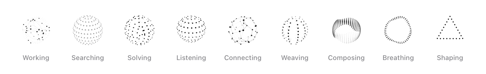
  </picture>
</p>

<h1 align="center">ThinkingOrbs for Flutter</h1>

<p align="center">
  Dotted, genuinely 3D loading indicators for AI and agent interfaces in Flutter.<br />
  Nine hand-tuned designs, two purpose-tuned sizes, one line to drop in.
</p>

<p align="center">
  <b>English</b> · <a href="README.zh-CN.md">简体中文</a>
</p>

<p align="center">
  <a href="https://pub.dev/packages/thinking_orbs_kit"></a>
  <a href="https://pub.dev/packages/thinking_orbs_kit/score"></a>
  <a href="https://opensource.org/licenses/MIT"></a>
  <a href="https://pub.dev/packages/thinking_orbs_kit"></a>
</p>

---

```dart
ThinkingOrb(design: OrbDesign.searching)
```

That is the whole integration. Eight of the nine designs are real 3D forms, rotated, depth-shaded and z-sorted, and the ninth is a morphing outline. All of them are drawn only in grayscale dots, so they sit quietly in any interface, light or dark. Every orb pauses itself when the app is backgrounded, stays in phase with the others on screen, and respects Reduce Motion.

## Installation

Add `flutter_thinking_orbs` to your `pubspec.yaml`:

```yaml
dependencies:
  thinking_orbs_kit: ^0.0.1
```

Then import it:

```dart
import 'package:thinking_orbs_kit/thinking_orbs_kit.dart';
```

## Quick start

```dart
import 'package:flutter/material.dart';
import 'package:thinking_orbs_kit/thinking_orbs_kit.dart';

class AssistantStatus extends StatelessWidget {
  const AssistantStatus({super.key});

  @override
  Widget build(BuildContext context) {
    return const ThinkingOrbLabel(
      'Searching the web…',
      design: OrbDesign.searching,
    );
  }
}
```

## The designs

Every design is an instance of `OrbDesign`. Pick the one that says what your agent is actually doing.

| Regular | Small | Design | In code | Reach for it when |
|:---:|:---:|---|---|---|
| <picture><source media="(prefers-color-scheme: dark)" srcset="assets/designs/working-regular-dark.gif">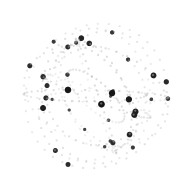</picture> | <picture><source media="(prefers-color-scheme: dark)" srcset="assets/designs/working-small-dark.gif"></picture> | **Working**<br><sub>Particles on tilted orbits</sub> | `OrbDesign.working` | General-purpose busy |
| <picture><source media="(prefers-color-scheme: dark)" srcset="assets/designs/searching-regular-dark.gif"></picture> | <picture><source media="(prefers-color-scheme: dark)" srcset="assets/designs/searching-small-dark.gif">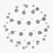</picture> | **Searching**<br><sub>A scan meridian sweeps a dotted globe</sub> | `OrbDesign.searching` | Web search, retrieval, lookups |
| <picture><source media="(prefers-color-scheme: dark)" srcset="assets/designs/solving-regular-dark.gif">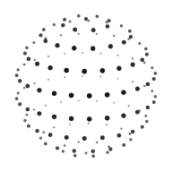</picture> | <picture><source media="(prefers-color-scheme: dark)" srcset="assets/designs/solving-small-dark.gif"></picture> | **Solving**<br><sub>Bands scramble, then click back solved</sub> | `OrbDesign.solving` | Reasoning, math, code |
| <picture><source media="(prefers-color-scheme: dark)" srcset="assets/designs/listening-regular-dark.gif"></picture> | <picture><source media="(prefers-color-scheme: dark)" srcset="assets/designs/listening-small-dark.gif">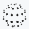</picture> | **Listening**<br><sub>A waveform rolls through the rings</sub> | `OrbDesign.listening` | Voice input, transcription |
| <picture><source media="(prefers-color-scheme: dark)" srcset="assets/designs/connecting-regular-dark.gif">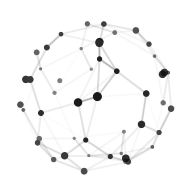</picture> | <picture><source media="(prefers-color-scheme: dark)" srcset="assets/designs/connecting-small-dark.gif">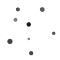</picture> | **Connecting**<br><sub>A constellation wires itself</sub> | `OrbDesign.connecting` | Tool calls, APIs, sync |
| <picture><source media="(prefers-color-scheme: dark)" srcset="assets/designs/weaving-regular-dark.gif">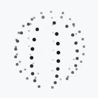</picture> | <picture><source media="(prefers-color-scheme: dark)" srcset="assets/designs/weaving-small-dark.gif"></picture> | **Weaving**<br><sub>Three strands plait around the sphere</sub> | `OrbDesign.weaving` | Planning, multi-step agents |
| <picture><source media="(prefers-color-scheme: dark)" srcset="assets/designs/composing-regular-dark.gif">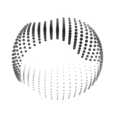</picture> | <picture><source media="(prefers-color-scheme: dark)" srcset="assets/designs/composing-small-dark.gif">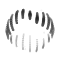</picture> | **Composing**<br><sub>An undulating multi-band sash</sub> | `OrbDesign.composing` | Writing a reply |
| <picture><source media="(prefers-color-scheme: dark)" srcset="assets/designs/breathing-regular-dark.gif"></picture> | <picture><source media="(prefers-color-scheme: dark)" srcset="assets/designs/breathing-small-dark.gif">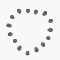</picture> | **Breathing**<br><sub>A ring slowly morphing</sub> | `OrbDesign.breathing` | Idle thinking, waiting on a model |
| <picture><source media="(prefers-color-scheme: dark)" srcset="assets/designs/shaping-regular-dark.gif">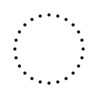</picture> | <picture><source media="(prefers-color-scheme: dark)" srcset="assets/designs/shaping-small-dark.gif"></picture> | **Shaping**<br><sub>Circle → triangle → square</sub> | `OrbDesign.shaping` | Design, image and layout work |

```dart
ThinkingOrb(design: OrbDesign.connecting);

// All nine, with names
Column(
  children: OrbDesign.values.map((design) {
    return ListTile(
      leading: ThinkingOrb(design: design, size: OrbSize.small),
      title: Text(design.title),
      subtitle: Text(design.summary),
    );
  }).toList(),
);
```

## Sizes

Two tuned sizes, and they are separate designs, not one design scaled: the small one has fewer, bigger dots and its own tempo, so it stays legible next to text.

```dart
ThinkingOrb(design: OrbDesign.working)                          // .regular: 64 pt, for avatars, empty states, hero moments
ThinkingOrb(design: OrbDesign.working, size: OrbSize.small)    // .small: 20 pt, for inline text, toolbars, list rows
ThinkingOrb(design: OrbDesign.solving, diameter: 56)           // the 64 pt design, drawn at 56 pt
```

## Status labels

<p align="center">
  <picture>
    <source media="(prefers-color-scheme: dark)" srcset="assets/labels-dark.gif">
    
  </picture>
</p>

`ThinkingOrbLabel` puts an orb beside a shimmering status line:

```dart
ThinkingOrbLabel('Searching the web…', design: OrbDesign.searching);

Container(
  padding: const EdgeInsets.symmetric(horizontal: 16, vertical: 8),
  decoration: BoxDecoration(
    color: Theme.of(context).colorScheme.surfaceContainerHighest,
    borderRadius: BorderRadius.circular(999),
  ),
  child: const ThinkingOrbLabel(
    'Thinking…',
    design: OrbDesign.breathing,
    size: OrbSize.regular,
    diameter: 44,
  ),
);
```

The shimmer is an extension modifier too, for any widget that should read as live:

```dart
const Text('Composing a reply…').thinkingShimmer();
```

## Deterministic Testing

For golden widget tests and snapshots, wrap the tree in `OrbClockOverride`:

```dart
OrbClockOverride(
  seconds: 1.25,
  child: ThinkingOrb(design: OrbDesign.composing),
);
```

## Accessibility & Reduce Motion

- **VoiceOver / TalkBack**: Automatically labels each orb with appropriate semantic accessibility traits (e.g. "Searching…").
- **Reduce Motion**: Automatically detects `MediaQuery.disableAnimations` and parks the orb on a representative static frame (`t = 0.6`) without CPU/GPU ticker overhead.
- **Contrast**: Respects high contrast accessibility settings.

## Credits & References

This package is a 1:1 Flutter port based on:
- **[haplollc/ThinkingOrbs](https://github.com/haplollc/ThinkingOrbs)**: The native Apple platform implementation by Haplo LLC, providing the Swift math engine, golden vectors, and SwiftUI API ergonomics.
- **[Jakubantalik/thinking-orbs](https://github.com/Jakubantalik/thinking-orbs)**: The original 3D geometry engine and motion designs by [Jakub Antalik](https://github.com/Jakubantalik) (see also [libraries.dev/orbs](https://libraries.dev/orbs)).

All 9 mathematical designs, 2 tuned scale profiles, 256-level ink quantization algorithms, and golden vector test suites are preserved faithfully.

## Reference Documentation

Detailed architectural and specification documents are included in the repository:
- `ref/spec.md`: Mathematical specifications, parameter tunings, and discrete design formulas.
- `ref/mapping.md`: SwiftUI to Flutter architectural translation guide.
- `ref/verification.md`: Golden test dataset details (72 cases verifying dot stride 6 and line stride 7).
- `ref/upstream/`: Original Swift upstream repository code for cross-referencing.

## License

MIT License. See [LICENSE](LICENSE) for details.
- Original thinking-orbs designs and engine by Jakub Antalik (MIT).
- Swift ThinkingOrbs by Haplo LLC (MIT).
- Flutter port by Chencheng Xie (MIT).
