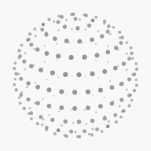
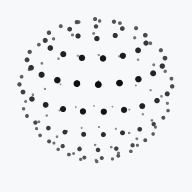
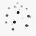
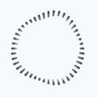
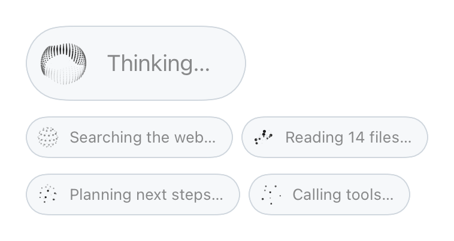

<p align="center">
  <picture>
    <source media="(prefers-color-scheme: dark)" srcset="assets/banner-dark.gif">
    
  </picture>
</p>

<h1 align="center">ThinkingOrbs</h1>

<p align="center">
  Dotted, genuinely 3D loading indicators for AI and agent interfaces in SwiftUI.<br />
  Nine hand-tuned designs, two purpose-tuned sizes, one line to drop in.
</p>

<p align="center">
  
  
  
  
  
</p>

---

```swift
ThinkingOrb(.searching)
```

That is the whole integration. Eight of the nine designs are real 3D forms, rotated, depth-shaded and z-sorted, and the ninth is a morphing outline. All of them are drawn only in grayscale dots, so they sit quietly in any interface, light or dark. Every orb pauses itself offscreen, stays in phase with the others on screen, and respects Reduce Motion.

**[Download the 30-second demo video (MP4)](assets/demo.mp4)**

## Installation

In Xcode: **File > Add Package Dependencies** and paste

```
https://github.com/haplollc/ThinkingOrbs
```

Or in `Package.swift`:

```swift
dependencies: [
    .package(url: "https://github.com/haplollc/ThinkingOrbs", from: "1.0.0")
]
```

Then add `ThinkingOrbs` to your target's dependencies.

## Quick start

```swift
import SwiftUI
import ThinkingOrbs

struct AssistantStatus: View {
    var body: some View {
        ThinkingOrbLabel("Searching the web…", design: .searching)
    }
}
```

## The designs

Every design is a case of `OrbDesign`. Pick the one that says what your agent is actually doing.

| Regular | Small | Design | In code | Reach for it when |
|:---:|:---:|---|---|---|
| <picture><source media="(prefers-color-scheme: dark)" srcset="assets/designs/working-regular-dark.gif"></picture> | <picture><source media="(prefers-color-scheme: dark)" srcset="assets/designs/working-small-dark.gif"></picture> | **Working**<br><sub>Particles on tilted orbits</sub> | `.working` | General-purpose busy |
| <picture><source media="(prefers-color-scheme: dark)" srcset="assets/designs/searching-regular-dark.gif"></picture> | <picture><source media="(prefers-color-scheme: dark)" srcset="assets/designs/searching-small-dark.gif"></picture> | **Searching**<br><sub>A scan meridian sweeps a dotted globe</sub> | `.searching` | Web search, retrieval, lookups |
| <picture><source media="(prefers-color-scheme: dark)" srcset="assets/designs/solving-regular-dark.gif"></picture> | <picture><source media="(prefers-color-scheme: dark)" srcset="assets/designs/solving-small-dark.gif"></picture> | **Solving**<br><sub>Bands scramble, then click back solved</sub> | `.solving` | Reasoning, math, code |
| <picture><source media="(prefers-color-scheme: dark)" srcset="assets/designs/listening-regular-dark.gif"></picture> | <picture><source media="(prefers-color-scheme: dark)" srcset="assets/designs/listening-small-dark.gif"></picture> | **Listening**<br><sub>A waveform rolls through the rings</sub> | `.listening` | Voice input, transcription |
| <picture><source media="(prefers-color-scheme: dark)" srcset="assets/designs/connecting-regular-dark.gif"></picture> | <picture><source media="(prefers-color-scheme: dark)" srcset="assets/designs/connecting-small-dark.gif"></picture> | **Connecting**<br><sub>A constellation wires itself</sub> | `.connecting` | Tool calls, APIs, sync |
| <picture><source media="(prefers-color-scheme: dark)" srcset="assets/designs/weaving-regular-dark.gif"></picture> | <picture><source media="(prefers-color-scheme: dark)" srcset="assets/designs/weaving-small-dark.gif"></picture> | **Weaving**<br><sub>Three strands plait around the sphere</sub> | `.weaving` | Planning, multi-step agents |
| <picture><source media="(prefers-color-scheme: dark)" srcset="assets/designs/composing-regular-dark.gif"></picture> | <picture><source media="(prefers-color-scheme: dark)" srcset="assets/designs/composing-small-dark.gif"></picture> | **Composing**<br><sub>An undulating multi-band sash</sub> | `.composing` | Writing a reply |
| <picture><source media="(prefers-color-scheme: dark)" srcset="assets/designs/breathing-regular-dark.gif"></picture> | <picture><source media="(prefers-color-scheme: dark)" srcset="assets/designs/breathing-small-dark.gif"></picture> | **Breathing**<br><sub>A ring slowly morphing</sub> | `.breathing` | Idle thinking, waiting on a model |
| <picture><source media="(prefers-color-scheme: dark)" srcset="assets/designs/shaping-regular-dark.gif"></picture> | <picture><source media="(prefers-color-scheme: dark)" srcset="assets/designs/shaping-small-dark.gif"></picture> | **Shaping**<br><sub>Circle → triangle → square</sub> | `.shaping` | Design, image and layout work |

```swift
ThinkingOrb(.connecting)

ForEach(OrbDesign.allCases) { design in      // all nine, with names
    Label { Text(design.title) } icon: { ThinkingOrb(design, size: .small) }
}
```

## Sizes

Two tuned sizes, and they are separate designs, not one design scaled: the small one has fewer, bigger dots and its own tempo, so it stays legible next to text.

```swift
ThinkingOrb(.working)                  // .regular: 64 pt, for avatars, empty states, hero moments
ThinkingOrb(.working, size: .small)    // .small: 20 pt, for inline text, toolbars, list rows
ThinkingOrb(.solving, diameter: 56)    // the 64 pt design, drawn at 56 pt
```

## Status labels

<p align="center">
  <picture>
    <source media="(prefers-color-scheme: dark)" srcset="assets/labels-dark.gif">
    
  </picture>
</p>

`ThinkingOrbLabel` puts an orb beside a shimmering status line. Style it like any other view:

```swift
ThinkingOrbLabel("Searching the web…", design: .searching)

ThinkingOrbLabel("Thinking…", design: .composing, size: .regular, diameter: 48)
    .font(.title3)
    .padding(8)
    .padding(.trailing, 20)
    .background(.thinMaterial, in: .capsule)
```

The shimmer is a modifier too, for any text that should read as live:

```swift
Text("Composing a reply…")
    .thinkingShimmer()
```

Titles localize the way `Text` does. A string literal is looked up in your strings, a `String` value is shown as-is, and you can pass your own `Text`:

```swift
ThinkingOrbLabel("Searching the web…", design: .searching)                   // localized, like Text
ThinkingOrbLabel("status.syncing", tableName: "Agent", design: .connecting)   // from your own table
ThinkingOrbLabel(modelOutput, design: .composing)                             // a String shows as-is
```

## Recipes

**Map your agent's state to a design.** Wrap it in a `ZStack` so the old and new orb share one slot while they crossfade:

```swift
enum AgentPhase {
    case idle, searching, reasoning, callingTools, writing

    var orb: OrbDesign {
        switch self {
        case .idle: .breathing
        case .searching: .searching
        case .reasoning: .solving
        case .callingTools: .connecting
        case .writing: .composing
        }
    }
}

ZStack {
    ThinkingOrb(phase.orb)
        .id(phase.orb)
        .transition(.opacity.animation(.easeInOut(duration: 0.25)))
}
```

**An "assistant is typing" bubble:**

```swift
HStack(alignment: .bottom, spacing: 10) {
    ThinkingOrb(.composing, diameter: 36)
    Text("Writing a reply…")
        .thinkingShimmer()
        .padding(.horizontal, 14)
        .padding(.vertical, 10)
        .background(.fill.tertiary, in: .rect(cornerRadius: 18))
}
```

**A status in the navigation bar:**

```swift
.toolbar {
    ToolbarItem(placement: .principal) {
        ThinkingOrbLabel("Syncing…", design: .connecting)
            .font(.subheadline)
    }
}
```

**A button that is busy:**

```swift
Button {
    Task { await generate() }
} label: {
    if isGenerating {
        ThinkingOrbLabel("Generating…", design: .shaping)
    } else {
        Label("Generate", systemImage: "sparkles")
    }
}
.buttonStyle(.bordered)
```

**An empty state while a model loads:**

```swift
ContentUnavailableView {
    ThinkingOrb(.breathing)
} description: {
    Text("Warming up the model…")
}
```

**A list row:**

```swift
LabeledContent("Indexing photos") {
    ThinkingOrb(.searching, size: .small)
}
```

## Appearance

The ink is strictly monochrome and follows the environment's color scheme: dark dots on light backgrounds, light dots on dark ones, with the depth shading mirrored so near dots always read strongest. To put an orb on a surface that doesn't match the app's scheme, pin it:

```swift
ThinkingOrb(.weaving)
    .environment(\.colorScheme, .dark)   // light dots, for a dark card in a light app
```

## Speed and pausing

```swift
ThinkingOrb(.listening, speed: 1.5)                 // a multiplier on the tuned speed
ThinkingOrb(.listening, isPaused: !isRecording)     // freezes on the current frame
```

## Accessibility

- Each orb is an image with a per-design VoiceOver label ("Searching…"). The defaults are English, so in a localized app, or anywhere a more specific label helps, set your own as usual: `.accessibilityLabel("Looking up flights…")`.
- `ThinkingOrbLabel` reads as one element: its title.
- With Reduce Motion on, orbs show a single representative frame and shimmering text holds still at full strength. With Increase Contrast on, shimmering text also stays at full strength.

## Performance

One `Canvas` per orb inside one `TimelineView`, with no view per dot. Orbs park their timeline while scrolled out of view, on either axis, so a card in a carousel that has itself scrolled off the page stops too. That holds from the very first layout, so orbs that start below the fold never run. They also park while the app is in the background.

Measured on an iPhone 17 Pro Max, the heaviest design (`.composing`, 566 dots) takes 65 µs to compute a frame and 0.27 ms to rasterize it, against 8.3 ms per frame at 120 Hz. Most designs cost a fraction of that.

## Draw it yourself

The geometry is public, for SpriteKit, Metal, a watch complication or a pen plotter. A frame is a finished draw list: every value is final and the array order is the draw order.

```swift
let frame = OrbDesign.connecting.frame(size: .regular, at: seconds)

for line in frame.lines {       // draw edges first
    // line.x1, line.y1, line.x2, line.y2, line.w in points
    // line.white and line.a are ink and opacity, as for dots
}
for dot in frame.dots {         // then dots, far to near
    // dot.x, dot.y, dot.r in points, in a 64 × 64 box
    // dot.white is ink (0 is darkest, mirror it on dark), dot.a is opacity
}
```

`seconds` is any running time in seconds at normal speed, such as a `TimelineView` date's `timeIntervalSinceReferenceDate`. The design's tuned speed is applied for you.

## Faithful to the original

These are Jakub Antalik's designs, and the port keeps them exact:

- **Transcribed, not reinterpreted.** The engine is a formula-by-formula port of the original TypeScript, down to evaluation order and JavaScript's rounding and loop semantics.
- **Golden vectors.** The test suite checks every dot and line of all nine designs at both sizes, at four instants each, against the web library's published geometry, to 1e-4. It runs on iPhone.
- **A dense differential sweep.** `Scripts/differential-sweep.sh` runs the original engine under Node and streams 725,149 frames (213 million dots) into the Swift engine on an iPhone simulator. Every frame matches, with a worst difference of 2e-9.
- **Pixels.** Rendered side by side with Chrome's canvas, tiles differ by less than one shade in 255 on average, with the differences in the antialiased edges of the dots. The iPhone draws the very smallest dots at their true size, where Chrome draws them faintly.

## Requirements

- iOS 17+, macOS 14+, tvOS 17+, watchOS 10+, visionOS 1+
- Swift 6, Xcode 16+

## Development

```bash
xcodebuild test -scheme ThinkingOrbs -destination "platform=iOS Simulator,name=iPhone 17 Pro"
Scripts/differential-sweep.sh      # prove parity with the original web engine
Scripts/render-media.sh            # re-render every GIF in this README
```

## Credits

The designs, their tuning and the original engine are [thinking-orbs](https://github.com/Jakubantalik/thinking-orbs) by [Jakub Antalik](https://github.com/Jakubantalik), MIT licensed. See them on the web at [orbs.jakubantalik.com](https://orbs.jakubantalik.com). This package is a native Swift port.

## License

ThinkingOrbs is available under the [MIT license](LICENSE), which carries both the original copyright and ours.

Made by [Haplo LLC](https://haploapp.com).
